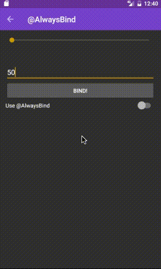

### Witch for Android

Functional view data binding.

### Getting started

```groovy
    compile 'se.snylt:witch:0.0.1-SNAPSHOT'
    annotationProcessor "se.snylt:witch-processor:0.0.1-SNAPSHOT"
```
Add snapshot repository

```groovy
  repositories {
    mavenCentral()
    maven {
        url "https://oss.sonatype.org/content/repositories/snapshots/"
    }
  }
```

### How to use:
Define view model
```java
public class MyViewModel {

  @BindTextView(id = R.id.title_tv)
  public String title;
  ...
}
```

Bind view model to view
```java
MyViewModel model = new MyViewModel("Hello Witch!"));
Witch.bind(model, activity); // Binds to anything that contains the views defined in view model.
```

### Set custom properties
Each specific bind-view-annotation sets a default property. For example, @BindTextView sets text by default.
```java
@BindTextView(id = R.id.text_view_title)
// Generates =>
((TextView)view).setText(property);
```
To set a property different from default one, use ```set=<property>```:
```java
@BindTextView(id = R.id.text_view_title, set="color")
// Generates =>
((TextView)view).setColor(property);
```

### Bind to any view type
Views not backed up by a specific annotation is supported by the @BindToView
```java
@BindToView(id = R.id.my_view, class = UnknownView.class, set = "myProperty")
// Generates =>
((UnknownView)view).setMyProperty(property)
```

### ViewHolders built in
Each view model will have its own view holder which eliminates the need for defining view holders in adapters:

```java
   @Override
    public RecyclerView.ViewHolder onCreateViewHolder(ViewGroup parent, int viewType) {
        // An empty view holder just containing the root view.
        LayoutInflater inflater = LayoutInflater.from(parent.getContext());
        return new SimpleViewHolder(inflater.inflate(R.layout.recycler_view_item, parent, false));
    }

    @Override
    public void onBindViewHolder(RecyclerView.ViewHolder holder, int position) {
        Witch.bind(items.get(position), holder.itemView);
    }
```

### Supported annotations

Direct view binding
```java
@BindToTextView
@BindToEditText
@BindToCompoundButton
@BindToImageView
@BindToRecyclerView
@BindToViewPager
@AlwaysBind
@BindToView
@BindTo
// More to come!
```

### Custom bind composition with Binder
One or more bind actions can be chained for more advanced bindings:

```java
Binder b = Binder.create(
    new SyncOnBind<TextView, String>(){
      @Override
      void onBind(TextView view, String text) {
        view.setText(text);
      }
    })
  .next(
    new SyncOnBind<TextView, String>(){
      @Override
      void onBind(TextView view, String text) {
        view.setVisibility(text == null ? View.INVISIBLE : View.VISIBLE);
      }
    });

    b.bind(view, "Hello Witch!");
```

Use ValueBinder with @BindTo annotation

```java
class ViewModel {

  private final String amount;

  @BindTo(R.id.amount_tv)
  public ValueBinder<TextView, String> amount(){
    // Binds amount and adds "dollars"
    return ValueBinder.create(amount,  Binder.create(
      new SyncOnBind<TextView, String> {
        @Override
        public void onBind(TextView view, String amount) {
          view.setText(amount + " dollars");
        }
      }
    ));
  }
}
```
Define actions in separate classes for better re-use:
```java
Binder.create(new SetText<TextView, String>())
.next(new AppendText<TextView, String>("dollars"))
.next(new InvisibleIfNull<TextView, String>());
```

### AsyncOnBind
Bind actions that has async dependencies, like animations, can delay bind chain with a callback.

```java
  Binder.create(
    new AsyncOnBind<TextView, String>(){
      @Override
      void onBind(TextView view, String text, final OnBindListener listener) {
        ObjectAnimator a = ObjectAnimator.ofFloat(view, View.ALPHA, 0f, 1f);
        a.setDuration(300);
        a.addListener(new AnimatorListenerAdapter() {
            @Override
            public void onAnimationEnd(Animator animation) {
                listener.onBindDone();
            }
        });
        a.start();
      }
    })
  .next(
    new SyncOnBind<TextView, String>(){
      @Override
      void onBind(TextView view, String text) {
        view.setText(text);
      }
    })
    .bind(view, "Hello world!");
```

### @AlwaysBind
By default Witch wont re-bind values that has not changed in the view model. If the view model is out of sync with the actual value in the view, for example when a seekbar is changed by the user, @AlwaysBind can be used to always refresh the binding.
```java
public class MyViewModel {

  @BindToView(R.id.my_seek_bar, class = SeekBar.class, set = "progress")
  @AlwaysBind
  public Integer progress;
}
```


License
-------

    Copyright 2017 Simon Edström

    Licensed under the Apache License, Version 2.0 (the "License");
    you may not use this file except in compliance with the License.
    You may obtain a copy of the License at

       http://www.apache.org/licenses/LICENSE-2.0

    Unless required by applicable law or agreed to in writing, software
    distributed under the License is distributed on an "AS IS" BASIS,
    WITHOUT WARRANTIES OR CONDITIONS OF ANY KIND, either express or implied.
    See the License for the specific language governing permissions and
    limitations under the License.
